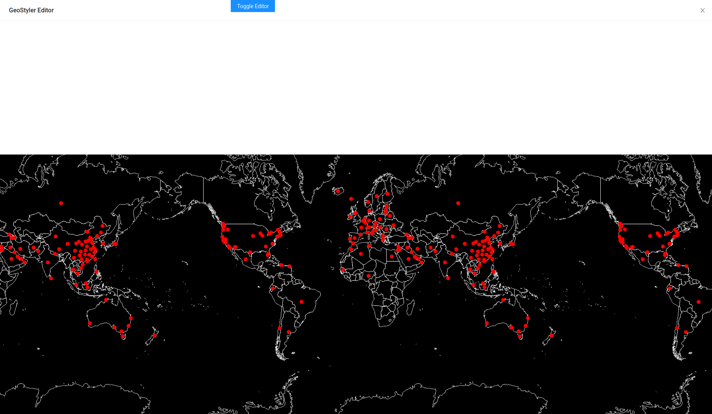

# Drawer und Toggle

In diesem Unterkapitel wird ein Button und ein Drawer von [antd](https://ant.design/components/button/) importiert. Der Button sorgt dafür, dass sich der Drawer per toggle ein- und ausblenden lässt. 

```javascript
<Drawer
  title='GeoStyler Editor'
  placement='top'
  closable={true}
  onClose={() => {
    setDrawerVisible(false);
  }}
  visible={drawerVisible}
  mask={false}
></Drawer>
```

Wie anhand des folgenden Code-Auszuges zu erkennen ist, geschieht der toggle-Effekt durch die Veränderung des aktuellen States (`currentState => !currentState`). Der Button und Drawer sind hierbei durch die `setDrawerVisible()`- Funktion vernüpft.

```javascript
      <Button
        className='ws-toggle-editor-btn'
        type='primary'
        onClick={() => {
          setDrawerVisible(currentState => !currentState);
        }}
      >
        Toggle Editor
      </Button>
```

> **info**
> Hier finden Sie weitere Informationen bezüglich [State](https://reactjs.org/docs/state-and-lifecycle.html) und [setState()](https://reactjs.org/docs/faq-state.html). 

***Aufgabe 1.***
Wenn Sie nun den Inhalt Ihrer `App.js` Datei erneut mit dem sich unterhalb dieses Abschnittes befindenden
Codes ersetzen und speichern, dann sollte Ihre Anwendung wie folgt im Browser dargestellt werden:

<br>

[](../images/stepFourImage.png)

Per Klick auf den Button öffnet sich folglich der Drawer (in der oberen Abbildung bereits geöffnet).

```javascript
import React, { useState, useEffect } from "react";

import OlMap from "ol/Map";
import OlView from "ol/View";
import DragPan from "ol/interaction/DragPan";
import { Drawer, Button } from "antd";

import isElementInViewport from "./viewportHelper";

import "./App.css";
import "ol/ol.css";
import "antd/dist/antd.css";
import "./Workshop.css";
import Attributions from "./Attributions";
import { getBaseLayer, getCovidLayer } from "./helper";

import { MapComponent } from "@terrestris/react-geo";

import covidDeath from "./data/covid-death.json";

var base = getBaseLayer();
var vector = getCovidLayer(covidDeath);

const center = [0, 8000000];

const map = new OlMap({
  view: new OlView({
    center: center,
    zoom: 2,
    projection: "EPSG:3857"
  }),
  layers: [base, vector],
  interactions: [new DragPan()]
});

function App() {
  let [drawerVisible, setDrawerVisible] = useState(false);
  let [visibleBox, setVisibleBox] = useState(0);

  useEffect(() => {
    // add scroll eventlistener
    // unfortunately, this will be re-run as soon as visible
    // box changes. Otherwise we don't have visible box in our scope
    const getVisibleBox = () => {
      const boxes = [
        document.getElementById("ws-overlay-1"),
        document.getElementById("ws-overlay-2"),
        document.getElementById("ws-overlay-3")
      ];
      const boxIdx = boxes.findIndex(box => isElementInViewport(box));
      return boxIdx >= 0 ? boxIdx : visibleBox;
    };

    const handleScroll = () => {
      const newVisibleBox = getVisibleBox();
      if (newVisibleBox !== visibleBox) {
        setVisibleBox(newVisibleBox);
      }
    };

    document.addEventListener("scroll", handleScroll);

    handleScroll();

    return () => {
      document.removeEventListener("scroll", handleScroll);
    };
  }, [visibleBox]);

  return (
    <div className='App'>
      <Button
        className='ws-toggle-editor-btn'
        type='primary'
        onClick={() => {
          setDrawerVisible(currentState => !currentState);
        }}
      >
        Toggle Editor
      </Button>
      <MapComponent map={map} />
      <Drawer
        title='GeoStyler Editor'
        placement='top'
        closable={true}
        onClose={() => {
          setDrawerVisible(false);
        }}
        visible={drawerVisible}
        mask={false}
      ></Drawer>
      <span id='ws-overlay-1' className='ws-overlay'>
        <h1>Overlay {visibleBox + 1}</h1>
        <p>Put your info text here</p>
      </span>
      <div id='ws-overlay-2' className='ws-overlay'>
        <h1>Overlay {visibleBox + 1}</h1>
        <p>Put your info text here</p>
      </div>
      <div id='ws-overlay-3' className='ws-overlay'>
        <h1>Overlay {visibleBox + 1}</h1>
        <p>Put your info text here</p>
      </div>
      <Attributions />
    </div>
  );
}

export default App;
```

Das nächste Überkapitel beschäftigt sich mit dem GeoStyler und geht dabei auf die grundlegende 
Verwendung der UI, des Daten Parsers und des Style Parsers ein.