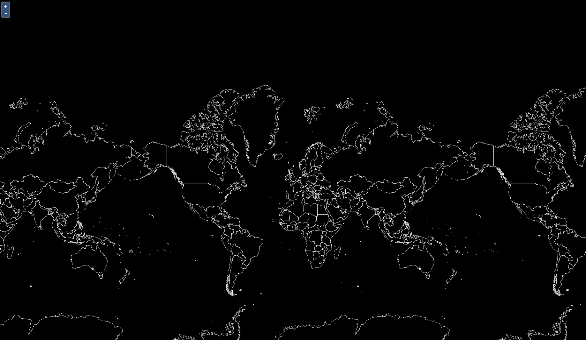

# MapComponent einbinden 

Nachdem wir `react-geo` erfolgreich installiert haben, können wir deren Komponenten in der
_{{ book.reactAppName }}_ Anwendung nutzen. Als nächstes werden wir react-geos
[Map Komponente](https://terrestris.github.io/react-geo/docs/latest/index.html#mapcomponent)
mit der Hintergrundkarte der Anwendung hinzufügen.
<br><br>

> **info**
> Falls Sie mehr über react-geo herausfinden möchten, dann können Sie [hier](https://terrestris.github.io/react-geo-ws/)
> an dem react-geo-Workshop teilnehmen.

<br>
***Aufgabe 1.***
Öffnen Sie dafür einen Texteditor Ihrer Wahl (falls noch nicht geschehen) und öffnen sie die Datei `App.js`
von dem `src` Ordner Ihrer _{{ book.reactAppName }}_ Anwendung. Ersetzen Sie den Inhalt der `App.js` Datei
mit dem Code im unteren Bereich dieser Seite. Speichern Sie die Datei und schauen Sie sich die Veränderung im
Browser an.

Dies sollte nun wie folgt aussehen:


[](../images/stepOneImage.png)


Betrachten Sie nun den Code etwas genauer: <br>


Bevor React, sowie OpenLayers und react-geo verwendet werden können, müssen diese zu Beginn der Anwendung aus der jeweiligen Bibliothek importiert werden.
Dies geschieht beispielsweise durch:

```javascript
import OlMap from "ol/Map";
import { MapComponent } from "@terrestris/react-geo";
```


Die react-geo Komponente dient als Wrapper für eine OpenLayers map. Die
`OlMap` Variable `map` wird der `MapComponent` als eine Property
(prop) hinzugefügt.

```javascript
<MapComponent map={map} />
```

Die Hintergrundkarte (im Code mit der Variable `base` genannt) ist eine eigene
isolierte react-geo Komponente und wird durch den Befehl
`import { getBaseLayer} from './helper';` der App.js Datei zugänglich gemacht.

> **info**
> Der Übersicht halber wurde diese Datei von `App.js` nach `helper.js` ausgelagert.

```javascript
import React from "react";

import OlMap from "ol/Map";
import OlView from "ol/View";
import DragPan from "ol/interaction/DragPan";

import "./App.css";
import "ol/ol.css";
import "antd/dist/antd.css";
import "./Workshop.css";
import { getBaseLayer } from "./helper";

import { MapComponent } from "@terrestris/react-geo";

var base = getBaseLayer();

const center = [0, 8000000];

const map = new OlMap({
  view: new OlView({
    center: center,
    zoom: 2,
    projection: "EPSG:3857"
  }),
  layers: [base],
  interactions: [new DragPan()]
});

function App() {
  return (
    <div className='App'>
      <MapComponent map={map} />
    </div>
  );
}

export default App;
```

