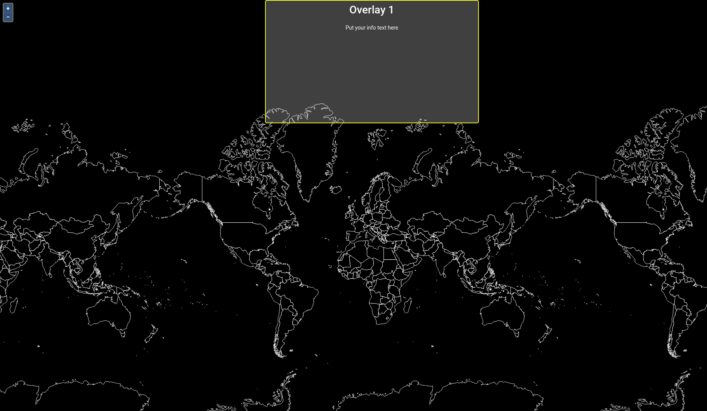

# Boxen hinzufügen

In diesem Abschnitt werden wir der Anwendung drei Boxen (div-Elemente, die durch Angabe von
width & height wie eine Box aussehen) hinzufügen, welche mit einem *scroll
eventlistener* versehen sind. Ziel ist es, den Style des Layers (welcher im folgenden Kapitel hinzugefügt wird) abhängig von der aktuell im Viewport zu sehenden Box zu verändern.

Die jeweiligen Boxen wurden wie folgt erstellt (hier beispielhaft die erste Box):

```javascript
<div id='ws-overlay-2' className='ws-overlay'>
  <h1>Overlay {visibleBox + 1}</h1>
  <p>Put your info text here</p>
</div>
```

Der `App.js` Datei wird durch den Befehl `import isElementInViewport from "./viewportHelper";` eine Funktion zugänglich gemacht, welche in der `viewportHelper.js` Datei definiert ist.

Diese Funktion erkennt die sich aktuell im Viewport befindende sichtbare Box.

> **info**
> Für diesen Workshop reicht es zu wissen, dass es diese Funktion gibt. Eine genaue Erläuterung des sich
> in der `vieportHelper.js` Datei befindenden Codes ist für diesen Workshop somit nicht relevant.

***Aufgabe 1.***
Ersetzen Sie nun den gesamten Code ihrer `App.js` Datei mit dem Code im unteren Bereich dieser Seite.
Ihre Anwendung sollte, insofern Sie die Datein gespeichert haben, nun wie folgt aussehen:


[](../images/stepTwoImage.png)

```javascript
import React, { useState, useEffect } from "react";

import OlMap from "ol/Map";
import OlView from "ol/View";
import DragPan from "ol/interaction/DragPan";

import isElementInViewport from "./viewportHelper";

import "./App.css";
import "ol/ol.css";
import "antd/dist/antd.css";
import "./Workshop.css";
import Attributions from "./Attributions";
import { getBaseLayer } from "./helper";

import { MapComponent } from "@terrestris/react-geo";

var base = getBaseLayer();

const center = [0, 8000000];

const map = new OlMap({
  view: new OlView({
    center: center,
    zoom: 2,
    projection: "EPSG:3857"
  }),
  layers: [base],
  interactions: [new DragPan()]
});

function App() {
  let [visibleBox, setVisibleBox] = useState(0);

  useEffect(() => {
    // add scroll eventlistener
    // unfortunately, this will be re-run as soon as visible
    // box changes. Otherwise we don't have visible box in our scope
    const getVisibleBox = () => {
      const boxes = [
        document.getElementById("ws-overlay-1"),
        document.getElementById("ws-overlay-2"),
        document.getElementById("ws-overlay-3")
      ];
      const boxIdx = boxes.findIndex(box => isElementInViewport(box));
      return boxIdx >= 0 ? boxIdx : visibleBox;
    };

    const handleScroll = () => {
      const newVisibleBox = getVisibleBox();
      if (newVisibleBox !== visibleBox) {
        setVisibleBox(newVisibleBox);
      }
    };

    document.addEventListener("scroll", handleScroll);

    handleScroll();

    return () => {
      document.removeEventListener("scroll", handleScroll);
    };
  }, [visibleBox]);

  return (
    <div className='App'>
      <MapComponent map={map} />
      <span id='ws-overlay-1' className='ws-overlay'>
        <h1>Overlay {visibleBox + 1}</h1>
        <p>Put your info text here</p>
      </span>
      <div id='ws-overlay-2' className='ws-overlay'>
        <h1>Overlay {visibleBox + 1}</h1>
        <p>Put your info text here</p>
      </div>
      <div id='ws-overlay-3' className='ws-overlay'>
        <h1>Overlay {visibleBox + 1}</h1>
        <p>Put your info text here</p>
      </div>
      <Attributions />
    </div>
  );
}

export default App;
```

Im nächsten Unterkapitel werden wir einen Layer der Karte hinzufügen.
