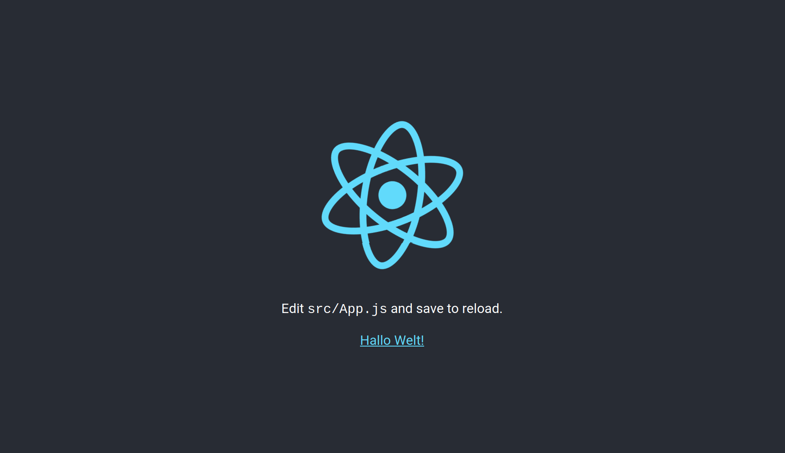

# Entwicklungsserver

`create-react-app` inkludiert einen [webpack](https://github.com/webpack/webpack) Entwicklungsserver.
Dieser Server ermöglicht Ihnen das 'Hot Deployment' Ihres bearbeiteten Codes. Dies bedeutet,
dass Ihre Code-Änderungen sofort im Browser sichtbar sind.

***Aufgabe 1.***
Bearbeiten Sie `src/App.js` (beipielsweise wie im Code unten), um die Anwendung zu verändern.

[](../images/halloWelt.png)

```javascript
import React from "react";
import logo from "./logo.svg";
import "./App.css";

function App() {
  return (
    <div className='App'>
      <header className='App-header'>
        
        <p>
          Edit <code>src/App.js</code> and save to reload.
        </p>
        <a
          className='App-link'
          href='https://reactjs.org'
          target='_blank'
          rel='noopener noreferrer'
        >
          Hallo Welt!
        </a>
      </header>
    </div>
  );
}

export default App;
```

Wie wir den GeoStyler und weitere notwendige Pakete für diese 
Anwendung installieren, werden wir uns im Folgenden genauer 
anschauen.