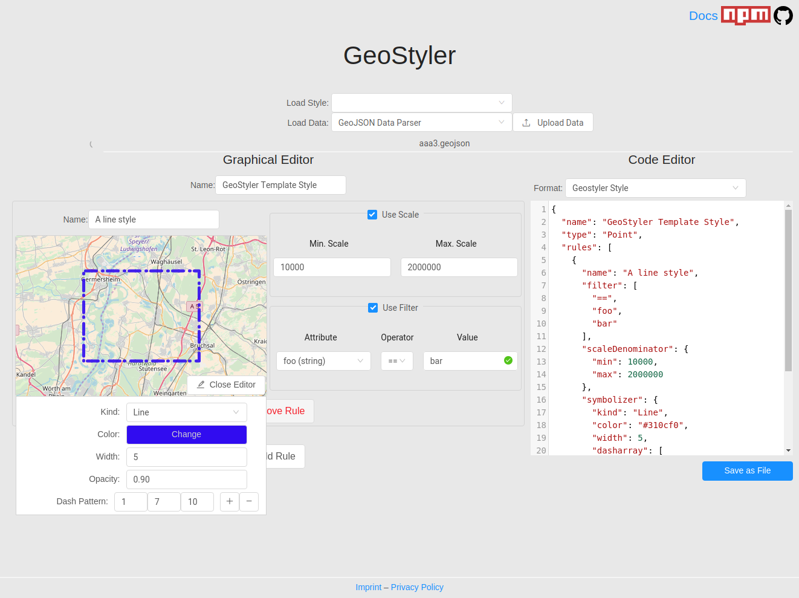

# GeoStyler einbinden

Im folgenden Überkapitel werden Sie endlich GeoStyler der Anwendung hinzufügen.

Zunächst wird jedoch kurz der Aufbau und die Funktionsweise des GeoStylers erläutert.

 

 
Das kartographische Stylen von Geodaten im Web ist seit Jahren ein wiederkehrendes 
Thema in der Geoinformatik-Welt. Es existieren verschiedenste Standards – Offizielle Standards, 
z.B. OGC Styled Layer Descriptor mit OGC Filter Encoding sowie Industriestandards, 
beispielsweise Mapbox Styles und projektbezogene Styling-Vorschriften, z.B. in QGIS oder OpenLayers.
  
Es fehlt jedoch eine interaktive webbasierte Software, um Anwender in die Lage zu versetzen
die kartographische Ausgestaltung ihrer Geodaten auf einfache Weise zu erledigen. Es gibt zwar
vereinzelte Lösungen für einzelne der oben genannten Standards, eine gesamtheitliche
Web-Oberfläche, um unter anderem auch Styling-Vorschriften in diverse Formate zu überführen, fehlte bislang.
  
Unter dem Projektnamen „GeoStyler“ entsteht aktuell ein webbasiertes Werkzeug zur interaktiven Erstellung
von kartographischen Style-Vorschriften für Geodaten.
 

 
Grundsätzlich besteht der GeoStyler aus fünf Hauptkomponenten:
1. [GeoStyler](https://github.com/geostyler/geostyler):
React basierte Komponenten Bibliothek, die es ermöglicht eine individuell angepasste 
GUI zum Editieren und Parsen kartographischer Styles zu entwickeln. 
1. [GeoStyler-Style](https://github.com/geostyler/geostyler-style):
Definition des in GeoStyler intern genutzten Styles. Die Nutzung eines zentralen 
Styles ermöglicht es von einem beliebigen externen Style zu jedem anderen externen 
Style zu parsen. Vorraussetzung dafür ist lediglich die Implementierung eines entsprechenden 
Style Parsers (siehe Punkt 4).
1. [Geostyler-Data](https://github.com/geostyler/geostyler-data):
Definition der in GeoStyler intern genutzten Datenstruktur.
1. Style Parser:
Implementierungen zum Parsen existierender Style-Vorschriften von/zu Geostyler-Style. 
Beispiele: [geostyler-sld-parser](https://github.com/geostyler/geostyler-sld-parser) und 
[geostyler-openlayers-parser](https://github.com/geostyler/geostyler-openlayers-parser)
1. Data Parser:
Implementierungen zum Parsen zu unterstützender Geodaten-Formate.
 

Aktuell können folgende Formate genutzt werden:
Style-Vorschriften

- OGC SLD
- OpenLayers Styles

Geodaten-Formate

- GeoJSON
- OGC WFS

GeoStyler wird als Open Source Projekt realisiert und die offene Architektur ermöglicht
es sehr einfach weitere Formate (sowohl für Style-Vorschriften als auch für Geodaten)
durch Implementierung entsprechender Parser in GeoStyler zu integrieren.
 

  
Für weitere Informationen bezüglich des GeoStylers besuchen Sie gerne die offzielle
[GeoStyler-Github Seite](https://github.com/geostyler/geostyler).
