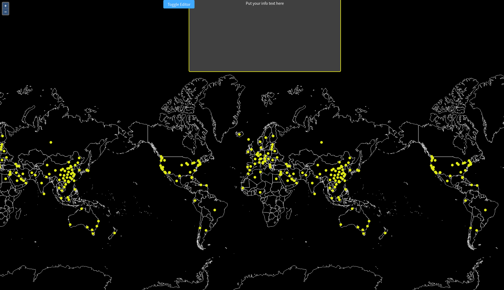

# Layer - Geostyler Verknüpfung

In diesem Unterkapitel wird der Geostyler mit dem Layer verküpft.

Darüber hinaus wird durch folgende Funktion die Karte jedes mal geupdated, 
wenn sich entweder eine andere Box im Viewport befindet, oder der Style geändert wird.

```javascript
  useEffect(() => {
    // update the map layer when either visibleBox or styles changes
    var newStyle = styles[visibleBox];
    if (newStyle) {
      olParser
        .writeStyle(newStyle)
        .then(olStyle => {
          console.log(oStyle)
          vector.setStyle(olStyle);
        })
        .catch(error => console.log(error));
    }
  });
```

***Aufgabe 1.***
Fügen sie die oben dargestellte Funktion der Anwendung hinzu.

***Aufgabe 2.***
Ändern Sie nun den Stil und Scrollen Sie hoch und runter (soweit, bis eine andere Box im Viewport sichtbar wird). Welche Veränderung wird sichtbar?

[](../images/stepSevenImage.png)
<br>
Wie Sie anhand der Abbildung erkennen können, wurde die Farbe des Layers verändert. Wenn Sie hoch und runter scrollen ändert sich der Style abhängig davon, welche Box aktuell im Viewport sichtbar ist.

Der Code Ihrer Lösung könnte wie folgt aussehen:

```javascript
import React, { useState, useEffect } from "react";

import OlMap from "ol/Map";
import OlView from "ol/View";
import DragPan from "ol/interaction/DragPan";
import { Drawer, Button } from "antd";

import OpenLayersParser from "geostyler-openlayers-parser";

import isElementInViewport from "./viewportHelper";

import "./App.css";
import "ol/ol.css";
import "antd/dist/antd.css";
import "./Workshop.css";
import Attributions from "./Attributions";
import { getDefaultStyle, getBaseLayer, getCovidLayer } from "./helper";

import { MapComponent } from "@terrestris/react-geo";

import { Style as GsStyle } from "geostyler";

import covidDeath from "./data/covid-death.json";

const defaultOlStyle = getDefaultStyle();

var base = getBaseLayer();
var vector = getCovidLayer(covidDeath);

const center = [0, 8000000];

const map = new OlMap({
  view: new OlView({
    center: center,
    zoom: 2,
    projection: "EPSG:3857"
  }),
  layers: [base, vector],
  interactions: [new DragPan()]
});

const olParser = new OpenLayersParser();

function App() {
  let [styles, setStyles] = useState([]);
  let [drawerVisible, setDrawerVisible] = useState(false);
  let [visibleBox, setVisibleBox] = useState(0);

  useEffect(() => {
    // on page init parse default style once
    // and setup the styles array
    olParser
      .readStyle(defaultOlStyle)
      .then(gsStyle => {
        const newStyles = [];
        for (var i = 0; i < 3; i++) {
          newStyles.push(JSON.parse(JSON.stringify(gsStyle.output)));
        }
        setStyles(newStyles);
      })
      .catch(error => console.log(error));
  }, []);

  useEffect(() => {
    // update the map layer when either visibleBox or styles changes
    var newStyle = styles[visibleBox];
    if (newStyle) {
      olParser
        .writeStyle(newStyle)
        .then(olStyle => {
          vector.setStyle(olStyle.output);
        })
        .catch(error => console.log(error));
    }
  });

  useEffect(() => {
    // add scroll eventlistener
    // unfortunately, this will be re-run as soon as visible
    // box changes. Otherwise we don't have visible box in our scope
    const getVisibleBox = () => {
      const boxes = [
        document.getElementById("ws-overlay-1"),
        document.getElementById("ws-overlay-2"),
        document.getElementById("ws-overlay-3")
      ];
      const boxIdx = boxes.findIndex(box => isElementInViewport(box));
      return boxIdx >= 0 ? boxIdx : visibleBox;
    };

    const handleScroll = () => {
      const newVisibleBox = getVisibleBox();
      if (newVisibleBox !== visibleBox) {
        setVisibleBox(newVisibleBox);
      }
    };

    document.addEventListener("scroll", handleScroll);

    handleScroll();

    return () => {
      document.removeEventListener("scroll", handleScroll);
    };
  }, [visibleBox]);

  return (
    <div className='App'>
      <Button
        className='ws-toggle-editor-btn'
        type='primary'
        onClick={() => {
          setDrawerVisible(currentState => !currentState);
        }}
      >
        Toggle Editor
      </Button>
      <MapComponent map={map} />
      <Drawer
        title='GeoStyler Editor'
        placement='top'
        closable={true}
        onClose={() => {
          setDrawerVisible(false);
        }}
        visible={drawerVisible}
        mask={false}
      >
        <GsStyle
          style={styles[visibleBox]}
          compact={true}
          onStyleChange={newStyle => {
            olParser
              .writeStyle(newStyle)
              .then(olStyle => {
                vector.setStyle(olStyle.output);
              })
              .catch(error => console.log(error));
            setStyles(oldStyles => {
              const newStyles = JSON.parse(JSON.stringify(oldStyles));
              newStyles[visibleBox] = newStyle;
              return newStyles;
            });
          }}
        />
      </Drawer>
      <span id='ws-overlay-1' className='ws-overlay'>
        <h1>Overlay {visibleBox + 1}</h1>
        <p>Put your info text here</p>
      </span>
      <div id='ws-overlay-2' className='ws-overlay'>
        <h1>Overlay {visibleBox + 1}</h1>
        <p>Put your info text here</p>
      </div>
      <div id='ws-overlay-3' className='ws-overlay'>
        <h1>Overlay {visibleBox + 1}</h1>
        <p>Put your info text here</p>
      </div>
      <Attributions />
    </div>
  );
}

export default App;
```

Im letzten Unterkapitel werden wir einen weiteren Parser (Daten Parser) hinzufügen, welcher es erlaubt, 
die UI mit Informationen der importierten Daten zu füllen.
