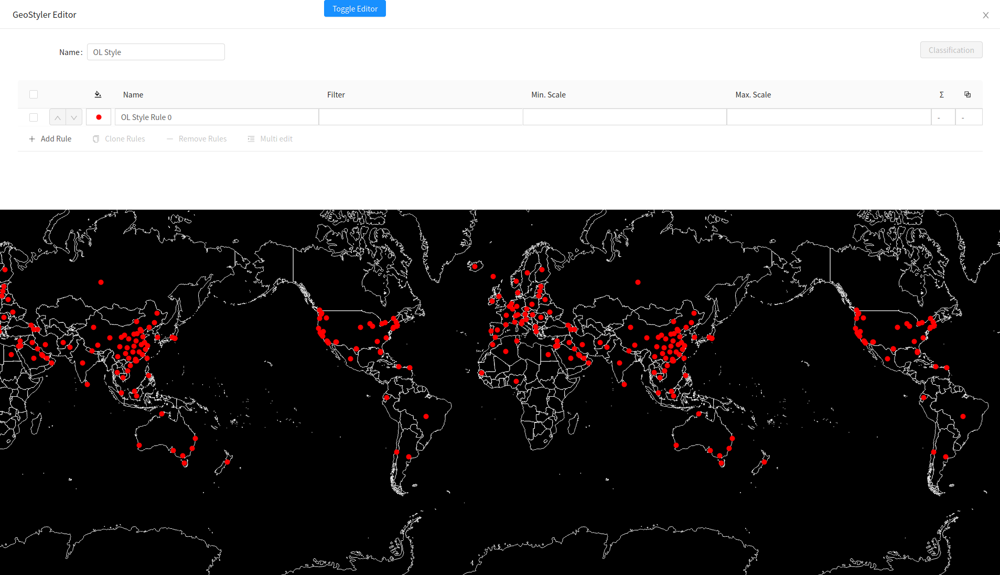

# Style Parser verwenden

In diesem Unterkapitel kommt erstmals ein Parser zum Einsatz. Dieser wird direkt
von der GeoStyler Bibliothek importiert und in der Variable `olParser` referenziert (s. folgender Code-Block). Der Parser wird verwendet, um von bereits existierenden Style-Vorschriften zu GeoStyler-Style zu transformieren.

```javascript
import OpenLayersParser from "geostyler-openlayers-parser";
const olParser = new OpenLayersParser();

OlParser
  .readStyle(defaultOlStyle)
  .then(gsStyle => console.log(gsStyle))
  .catch(error => console.log(error));
```

Desweiteren wird ein _defaultOlStyle_ definiert (ebenfalls aus der `helper.js` Datei importiert).

```javascript
import { getDefaultStyle } from "./helper";
const defaultOlStyle = getDefaultStyle();
```

Der `OpenLayersParser` ermöglicht hierbei, dass die Style-Vorschriften in den GeoStyler-Style überführt 
werden. Das `defaultOlStyle` kann somit geparst werden.

Der `GeoStyler` nimmt nun einen Stil an, jedoch verändert sich dieser beim Scrollen noch nicht. Diese 
Verknüpfung mit den Daten erfolgt erst im kommenden Kapitel.

***Aufgabe 1.***
???

Die Applikation sollte nun wie folgt aussehen:

[](../images/stepSixImage.png)

Der Code Ihrer Lösung könnte wie folgt aussehen:

```javascript
import React, { useState, useEffect } from "react";

import OlMap from "ol/Map";
import OlView from "ol/View";
import DragPan from "ol/interaction/DragPan";
import { Drawer, Button } from "antd";

import OpenLayersParser from "geostyler-openlayers-parser";

import isElementInViewport from "./viewportHelper";

import "./App.css";
import "ol/ol.css";
import "antd/dist/antd.css";
import "./Workshop.css";
import Attributions from "./Attributions";
import { getDefaultStyle, getBaseLayer, getCovidLayer } from "./helper";

import { MapComponent } from "@terrestris/react-geo";

import { Style as GsStyle } from "geostyler";

import covidDeath from "./data/covid-death.json";

const defaultOlStyle = getDefaultStyle();

var base = getBaseLayer();
var vector = getCovidLayer(covidDeath);

const center = [0, 8000000];

const map = new OlMap({
  view: new OlView({
    center: center,
    zoom: 2,
    projection: "EPSG:3857"
  }),
  layers: [base, vector],
  interactions: [new DragPan()]
});

const olParser = new OpenLayersParser();

function App() {
  let [styles, setStyles] = useState([]);
  let [drawerVisible, setDrawerVisible] = useState(false);
  let [visibleBox, setVisibleBox] = useState(0);

  useEffect(() => {
    // on page init parse default style once
    // and setup the styles array
    olParser
      .readStyle(defaultOlStyle)
      .then(gsStyle => {
        const newStyles = [];
        for (var i = 0; i < 3; i++) {
          newStyles.push(JSON.parse(JSON.stringify(gsStyle)));
        }
        setStyles(newStyles);
      })
      .catch(error => console.log(error));
  }, []);

  useEffect(() => {
    // add scroll eventlistener
    // unfortunately, this will be re-run as soon as visible
    // box changes. Otherwise we don't have visible box in our scope
    const getVisibleBox = () => {
      const boxes = [
        document.getElementById("ws-overlay-1"),
        document.getElementById("ws-overlay-2"),
        document.getElementById("ws-overlay-3")
      ];
      const boxIdx = boxes.findIndex(box => isElementInViewport(box));
      return boxIdx >= 0 ? boxIdx : visibleBox;
    };

    const handleScroll = () => {
      const newVisibleBox = getVisibleBox();
      if (newVisibleBox !== visibleBox) {
        setVisibleBox(newVisibleBox);
      }
    };

    document.addEventListener("scroll", handleScroll);

    handleScroll();

    return () => {
      document.removeEventListener("scroll", handleScroll);
    };
  }, [visibleBox]);

  return (
    <div className='App'>
      <Button
        className='ws-toggle-editor-btn'
        type='primary'
        onClick={() => {
          setDrawerVisible(currentState => !currentState);
        }}
      >
        Toggle Editor
      </Button>
      <MapComponent map={map} />
      <Drawer
        title='GeoStyler Editor'
        placement='top'
        closable={true}
        onClose={() => {
          setDrawerVisible(false);
        }}
        visible={drawerVisible}
        mask={false}
      >
        <GsStyle
          style={styles[visibleBox]}
          compact={true}
          onStyleChange={newStyle => {
            setStyles(oldStyles => {
              const newStyles = JSON.parse(JSON.stringify(oldStyles));
              newStyles[visibleBox] = newStyle;
              return newStyles;
            });
          }}
        />
      </Drawer>
      <span id='ws-overlay-1' className='ws-overlay'>
        <h1>Overlay {visibleBox + 1}</h1>
        <p>Put your info text here</p>
      </span>
      <div id='ws-overlay-2' className='ws-overlay'>
        <h1>Overlay {visibleBox + 1}</h1>
        <p>Put your info text here</p>
      </div>
      <div id='ws-overlay-3' className='ws-overlay'>
        <h1>Overlay {visibleBox + 1}</h1>
        <p>Put your info text here</p>
      </div>
      <Attributions />
    </div>
  );
}

export default App;
```

Wie sich der Layer abhängig von der aktuell im Viewport zu sehenden Box verändert, werden wir
im nächsten Kapitel sehen. 