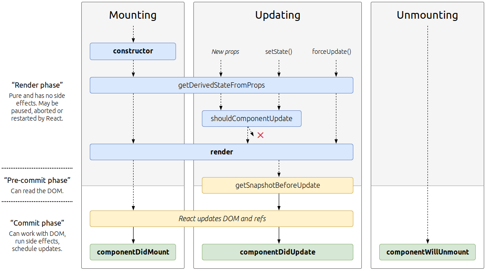

# React


[React](https://reactjs.org) ist eine moderne und quelloffene JavaScript-Bibliothek zur Erstellung von Benutzeroberflächen auf der Basis von ES6.
Ursprünglich wurde react von einem Software-Ingenieur bei Facebook entwickelt und wird weiterhin von Facebook (unter anderem) gewartet.

Mit React können Entwickler Webanwendungen erstellen, die Daten verwenden, welche sich im Laufe der Zeit ändern können, ohne die
Seite neu zu laden. Es zielt in erster Linie auf Geschwindigkeit, Einfachheit und Skalierbarkeit ab. React verarbeitet nur
Benutzeroberflächen in Anwendungen. Dies entspricht dem View im Model-View-Controller (MVC)-Muster
und kann in Kombination mit anderen JavaScript-Bibliotheken oder Frameworks in MVC, wie z.B. AngularJS, verwendet werden.

Das kleinste React-Beispiel sieht wie folgt aus:

```
ReactDOM.render(
  <h1>Hello, world!</h1>,
  document.getElementById('root')
);>
```

Folgen Sie den [docs](https://reactjs.org/docs/hello-world.html) und dem [Tutorial](https://reactjs.org/tutorial/tutorial.html) für weitere Informationen.

## Props

Props sind die Konfigurationen der Komponente, die Sie an Instanzen übergeben. Sie werden von der oben genannten Komponente
empfangen und sind unveränderlich. Ausführliche Informationen finden Sie unter [Components und Props](https://reactjs.org/docs/components-and-props.html).

## State

Die state speichert intere Werte einer Komponente. Es handelt sich hier um eine _serialisierbare_ Darstellung eines Zeitpunkts -
eine Momentaufnahme. Der Zustand kann innerhalb einer Komponente über `setState` manipuliert werden. Ausführliche Informationen finden Sie unter
[State und Lifecycle](https://reactjs.org/docs/state-and-lifecycle.html).

## Lifecycle


[Bildquelle](http://projects.wojtekmaj.pl/react-lifecycle-methods-diagram/), letzter Zugriff 08.04.2020.

Siehe [State und Lifecycle](https://reactjs.org/docs/state-and-lifecycle.html)

# JSX

React-Komponenten werden normalerweise in JSX geschrieben, einer JavaScript-Erweiterungssyntax, die das Zitieren von HTML und die
Verwendung der HTML-Tag-Syntax zur Darstellung von Unterkomponenten ermöglicht. Die HTML-Syntax wird in JavaScript-Aufrufe
des React-Frameworks verarbeitet. Entwickler können auch in reinem JavaScript schreiben. Ein Beispiel für JSX-Code:

```
import React from 'react';

class App extends React.Component {
  render() {
    return (
      <div>
        <p>Header</p>
        <p>Content</p>
        <p>Footer</p>
      </div>
    );
  }
}

export default App;
```

In diesem Workshop werden wir [Functions](https://reactjs.org/docs/components-and-props.html) verwenden.